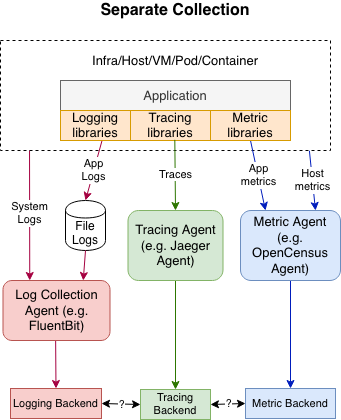
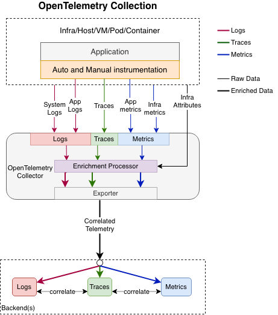
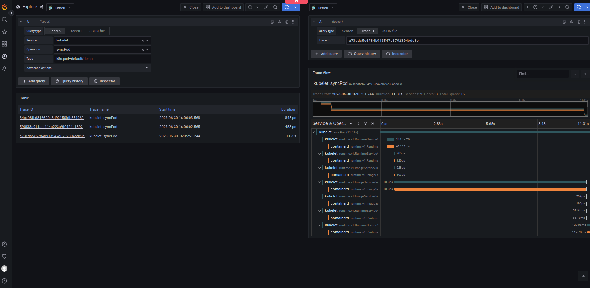
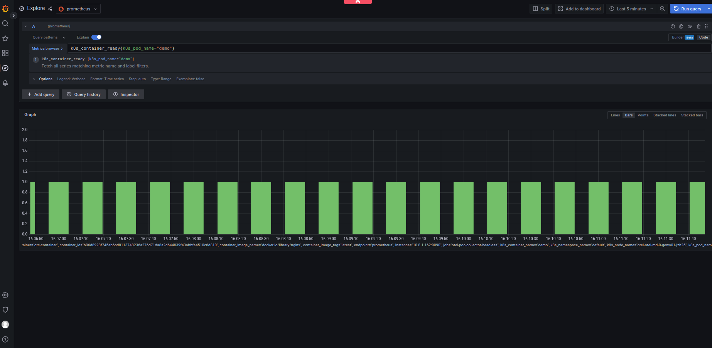
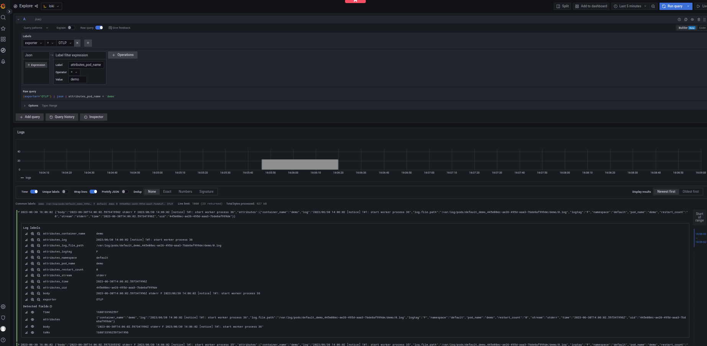

# PoC: SCS KaaS system components monitoring using OpenTelemetry

This is a PoC of SCS KaaS system components monitoring solution based on [OpenTelemetry](https://opentelemetry.io) (OTel) 
project. 

## OpenTelemetry

Note: This section contains selected highlights from OTel docs

OTel is an Observability framework and toolkit designed to create and manage 
telemetry data such as traces, metrics, and logs. It is vendor- and tool-agnostic approach!

- OTel [docs](https://opentelemetry.io/docs)
- To get started with OTel read [this](https://opentelemetry.io/docs/what-is-opentelemetry/). 
- To get started with OTel on Kubernetes read [this](https://opentelemetry.io/blog/2023/k8s-runtime-observability/).

In order to make a system observable, it must be instrumented. That is, the code must
emit traces, metrics, and logs. The instrumented data must then be sent to an Observability
backend.

Limitations of non-OpenTelemetry Solutions

Existing Observability solutions are currently weakly integrated. There is
no standardized way to include the information about the origin and source of logs
(such as the application and the location/infrastructure where the application runs)
that is uniform with traces and metrics and allows all telemetry data to be fully
correlated in a precise and robust manner.
This is how a typical non-OpenTelemetry observability collection pipeline looks like today:



OpenTelemetry Solution

OTel increases the individual and combined value of observability information for legacy
and modern systems by standardizing log correlation with traces and metrics, by adding
support for distributed context propagation for logs, and by unification of source attribution
of logs, traces and metrics.
This is the vision of OpenTelemetry’s collection of logs, traces and metrics:



For traces and metrics OTel defines a new API that application developers must use to
emit traces and metrics. For logs, OTel did not take the same path. OTel defines a log
data model to have a common understanding of what a LogRecord is. Newly designed logging
systems are expected to emit logs according to OTel’s log data model, and existing log
formats can be unambiguously mapped to OTel log data model.

- For further details visit related docs: [logs](https://opentelemetry.io/docs/specs/otel/logs/), [metrics](https://opentelemetry.io/docs/specs/otel/metrics/) and [traces](https://opentelemetry.io/docs/concepts/signals/traces/)

## The Aim of this PoC

The aim of this PoC is to gather traces, metrics, and logs from SCS KaaS system components using the CNCF
observability framework OTel. The aim is also to visualize all of them using the Grafana tool and
demonstrate the correlation between traces, metrics, and logs, i.e., demonstrate the OTel added value.

As the k8s log library `klog` [does not support](https://github.com/kubernetes/klog/issues/356) injecting of
trace_id and span_id into the log message (if they are available in the current context), the
correlation between signals will be demonstrated by common source (pod, node ..) attributes which will be
attached to all three signals.

The following is planned to cover by this PoC:

**Traces**

- kube-apiserver (alpha support of traces in k8s v1.22 (Aug. 2021) and beta in k8s v1.27 (Apr. 2023))
- kubelet (alpha support of traces in k8s v1.25 (Aug. 2022) and beta in k8s v1.27 (Apr. 2023))
- containerd (CRI) (traces since Aug. 2021)

Note: (taken from k8s docs): Please note that exporting spans (traces) always comes with a small
performance overhead on the networking and CPU side, depending on the overall configuration
of the system. If there is any issue like that in a cluster which is running with tracing 
enabled, then mitigate the problem by either reducing the samplingRatePerMillion or disabling 
tracing completely by removing the configuration.

**Metrics**

- kube-apiserver
- kubelet
- containerd (CRI)

As an alternative to the above there is a [k8s cluster receiver](https://github.com/open-telemetry/opentelemetry-collector-contrib/tree/main/receiver/k8sclusterreceiver)
that collects cluster-level metrics from the Kubernetes API server (similar to the kube-state-metrics project). 

**Logs**

- kube-apiserver
- kubelet
- containerd (CRI)

## PoC

### Create cluster

Create SCS KaaS cluster. Make sure you have cert-manager enabled. It is required by 
operators (OTel, Jaeger, Prometheus).

- Clone SCS KaaS repository
```bash
git clone https://github.com/SovereignCloudStack/k8s-cluster-api-provider
cd k8s-cluster-api-provider/terraform
```
- Create environment file
```bash
cat > terraform/environments/environment-otel.tfvars << EOF
prefix            = "otel"
cloud_provider    = "otel"

availability_zone = "nova"
external          = "ext01"
kind_flavor       = "SCS-2V:4:20"
controller_flavor = "SCS-8V:16:50"
worker_flavor     = "SCS-8V:16:50"

controller_count  = 1
worker_count      = 2
kubernetes_version = "v1.27.x"
testcluster_name  = "otel"
deploy_cert_manager = "true"
EOF
```
- Ensure that your [clouds.yaml](https://docs.openstack.org/python-openstackclient/latest/configuration/index.html) file contains OpenStack project access info
  - This PoC expect that the cloud name is `otel`
- Create cluster
```bash
OS_CLOUD=otel make create
```
     
- Download and export kubeconfig file of created cluster, and check whether the cluster is reachable and running
```bash
OS_CLOUD=otel make get-kubeconfig USERNAME=ubuntu TESTCLUSTER=otel
export KUBECONFIG=otel.yaml.otel
kubectl cluster-info
kubectl get nodes  # wait until all nodes are ready
kubectl get po -A  # wait until all control plane components are ready
```

### Observability backends (Loki, Prometheus, Jaeger) and Grafana

#### Jaeger Operator and Jaeger instance

- Deploy Jaeger operator, [source](https://www.jaegertracing.io/docs/1.45/operator/)
```bash
kubectl create namespace observability
kubectl create -f https://github.com/jaegertracing/jaeger-operator/releases/download/v1.45.0/jaeger-operator.yaml -n observability
```
- Deploy Jaeger instance - the AllInOne image !only for development!
```bash
kubectl apply -f ../Otel/manifests/jaeger_poc.yaml
```

#### Prometheus Operator and Prometheus instance

- Deploy Prometheus operator, [source](https://grafana.com/docs/grafana-cloud/kubernetes-monitoring/other-methods/prometheus/prometheus_operator/)
```bash
kubectl create -f https://raw.githubusercontent.com/prometheus-operator/prometheus-operator/master/bundle.yaml
```
- Deploy Prometheus instance and servicemonitor for otel collector, [source](https://github.com/open-telemetry/opentelemetry-go/blob/main/example/otel-collector/README.md)
```bash
kubectl apply -f ../Otel/manifests/prometheus_poc.yaml
```

#### Loki instance

- Deploy Grafana Loki single binary, i.e. monolithic mode !only for development!, [source](https://github.com/grafana/loki/issues/6729#issuecomment-1324208128)
```bash
helm upgrade --install loki loki \
  --repo https://grafana.github.io/helm-charts \
  --values ../Otel/manifests/loki_poc_values.yaml
```

#### Grafana instance

- Deploy Grafana instance and register Jaeger, Prometheus and Loki datasources, [source](https://grafana.com/docs/grafana/latest/setup-grafana/installation/kubernetes/)
```bash
kubectl apply -f ../Otel/manifests/grafana_poc.yaml
```

**Access backends (Jaeger, Prometheus) UIs and Grafana as follows:**

- Find out public IP address of the ingress controller load balancer e.g. as follows:
 ```bash
kubectl get svc -n ingress-nginx ingress-nginx-controller -ojsonpath={.status.loadBalancer.ingress[0].hostname}
```

- Jaeger query UI should be available on `http://<public IP address>/traces`
- Prometheus query UI should be available on `http://<public IP address>/metrics`
- Grafana UI should be available on `http://<public IP address>/grafana`
  - user: `admin`; password: `admin`

### OTel Operator and OTel Collector instance

- Deploy OTel operator, [source](https://opentelemetry.io/docs/k8s-operator/)
```bash
kubectl apply -f https://github.com/open-telemetry/opentelemetry-operator/releases/latest/download/opentelemetry-operator.yaml 
```

- Create an OpenTelemetry Collector (OTelCol) instance
```bash
kubectl apply -f ../Otel/manifests/otel_poc.yaml
```

## DEMO

- Deploy a simple `demo` application 
```bash
kubectl run demo --image nginx
```

See related signals (metrics, logs, traces) in Grafana

- kubelet/containerd traces:


- k8s cluster receiver metrics:


- app logs


### TODOs

Must have:
  - kubeapiserver logs does not contain attributes
    - Search for `attributes_log_file_path`: `/var/log/pods/kube-system_kube-apiserver` in Grafana/Loki DS
  - Gather kubelet, containerd logs via OTel collector
    - Alternative 1. [journaldreceiver](https://github.com/open-telemetry/opentelemetry-collector-contrib/tree/main/receiver/journaldreceiver)
      - issue: an official otelcol images do not contain the journald binary; we will need to create/find custom image
    - Alternative 2. setup separate OTel collector, per node
  - Gather kubelet, containerd metrics via OTel collector
    - k8s cluster receiver does not provide metrics like cadvisor in kubelet does (e.g. containers cpu/mem consumption) 
Deployment related:
  - Use port 4317 instead of 32317 in apiserver/kubelet/containerd trace configs, nad remove `otel-poc-collector-node` service
    - The above is possible because `spec.hostNetwork.true` has been set in OTel collector
  - Deploy operators, backends, etc. to the namespaces (logically)
  - Adjust Loki deployment (e.g. loki-canary, loki-grafana-agent-operator are not needed for PoC)
  - Grafana - disable changing password request when log-in for the first time (not needed for PoC))
Nice to have:
  - Add app instrumentation example (e.g. python flask app) and demonstrate the full power of OTel operator in K8s

### Status - Kubernetes metrics collected by OTel

Open issue [#562](https://github.com/open-telemetry/opentelemetry-helm-charts/issues/562) pointed out that
would be great to have OTel alternative to the widely used kube-prometheus-stack.
There is a proposal called [kube-otel-stack](https://github.com/lightstep/otel-collector-charts/tree/main/charts/kube-otel-stack)
which installs a pre-configured collector and target allocator to dynamically ServiceMonitor and PodMonitor custom resources to scrape various Kubernetes metrics.
This should be a 'transition' chart, from `kube-prometheus-stack` to the pure `opentelemetry-operator`:
Migration path could be something like: kube-prometheus-stack -> kube-otel-stack -> opentelemetry-operator.

It seems that kube-otel-stack is not ready and stable enough yet.

## Sources

Blogs/readmes:
- https://opentelemetry.io/blog/2023/k8s-runtime-observability/
- https://isitobservable.io/open-telemetry/how-to-observe-your-kubernetes-cluster-with-opentelemetry
    - https://github.com/isItObservable/Otel-Collector-Observek8s
- https://github.com/open-telemetry/opentelemetry-go/blob/main/example/otel-collector/README.md

OTel:
- OpenTelmetry Collector Core: https://github.com/open-telemetry/opentelemetry-collector
- OpenTelemetry Collector Contrib: https://github.com/open-telemetry/opentelemetry-collector-contrib
- k8sCluster receiver: https://github.com/open-telemetry/opentelemetry-collector-contrib/tree/main/receiver/k8sclusterreceiver
- Kubelet Receiver: https://github.com/open-telemetry/opentelemetry-collector-contrib/tree/main/receiver/kubeletstatsreceiver
- k8sAttributes processor: https://github.com/open-telemetry/opentelemetry-collector-contrib/tree/main/processor/k8sattributesprocessor

Tuning:
- https://github.com/monitoringartist/opentelemetry-trace-pipeline-poisoning#mitigation-of-huge-4mb-trace

